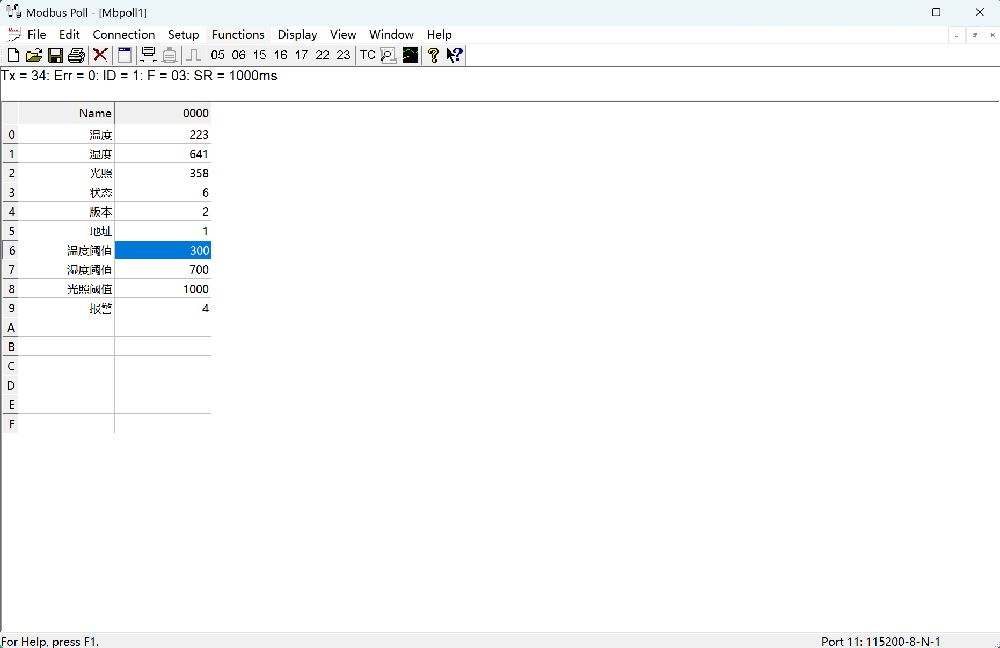
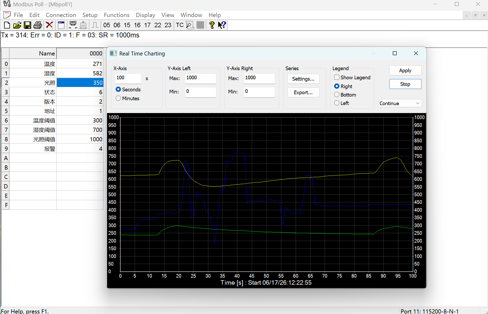
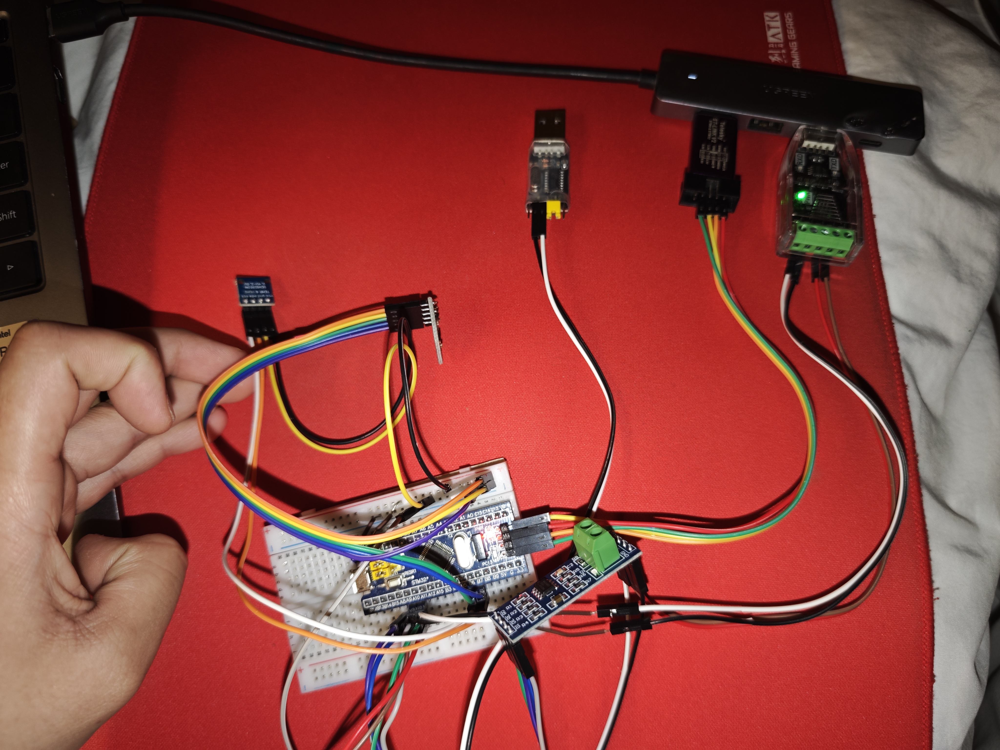
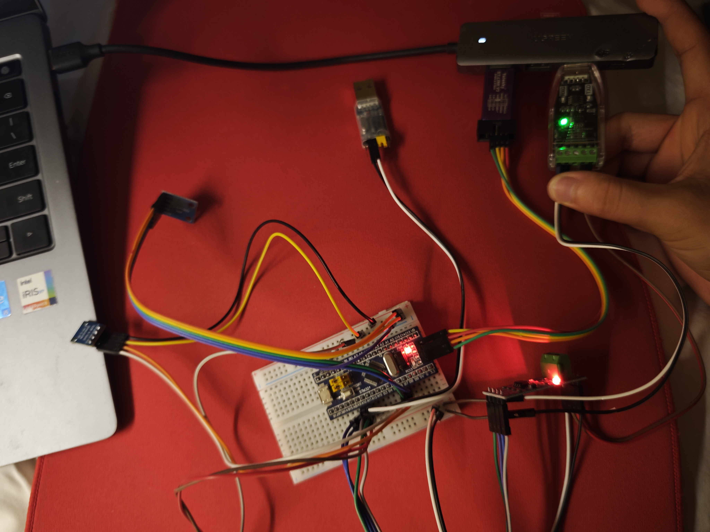

# Industrial Environment Monitor V2.0

基于 STM32F103 + FreeRTOS + RS485 + Modbus RTU 的工业环境监测终端。

## 项目简介

本项目模拟工业现场环境监测节点，实现温湿度与光照数据采集，并通过 RS485 总线和 Modbus RTU 协议与上位机进行通信。

系统支持实时数据监测、报警阈值配置、参数掉电保存以及远程寄存器访问，仅作为个人的学习与实践项目，此项目主要学习git的使用过程。

---

## 项目功能
### 运行图

* Modbus Poll
 
* 简易上位机

### 环境数据采集

* SHT30 温湿度传感器
* BH1750 光照传感器
* 周期性采集环境数据

### Modbus RTU 通信

支持：

* 03 读保持寄存器
* 06 写单寄存器

通信接口：

* USART1
* RS485
* DMA + IDLE 接收

### 参数掉电保存

保存内容：

* 温度报警阈值
* 湿度报警阈值
* 光照报警阈值
* 设备配置参数

存储介质：

* STM32 Internal Flash

### 报警功能

当环境参数超过设定阈值时：

* 触发报警标志
* 上位机实时显示报警状态

### 系统可靠性

* 独立看门狗(IWDG)
* 串口异常恢复
* CRC16 校验
* Modbus异常处理

### 上位机

Python开发

功能：

* 实时数据显示
* 波形显示
* 设备信息查看
* Modbus寄存器访问
* 06功能码参数配置

---
## 系统架构图

                  ┌─────────────────┐
                  │ Python 上位机   │
                  │ PyQt5/Pyside6   │
                  └────────┬────────┘
                           │
                      Modbus RTU
                           │
                    USB-RS485
                           │
            ┌──────────────┴──────────────┐
            │                             │
      ┌─────▼─────┐
      │ STM32F103 │
      └─────┬─────┘
            │
    ┌───────┼────────┬─────────┐
    │       │        │         │
    ▼       ▼        ▼         ▼
 SHT30   BH1750   Flash     IWDG
温湿度    光照    参数保存   看门狗

## 软件架构

Application
│
├── Sensor Manager
├── Alarm Manager
├── Storage Manager
│
Middleware
│
├── Modbus RTU
└── CRC16
│
BSP
│
├── SHT30
├── BH1750
├── RS485
└── Soft IIC

---

## 硬件平台

MCU

* STM32F103C8T6

Sensors

* SHT30
* BH1750

Communication

* MAX485
* USB-RS485

Debug

* ST-Link V2

---

## Modbus寄存器映射

| 地址     | 描述     |
| ------ | ------ |
| 0x0000 | 温度     |
| 0x0001 | 湿度     |
| 0x0002 | 光照     |
| 0x0006 | 温度报警阈值 |
| 0x0007 | 湿度报警阈值 |
| 0x0008 | 光照报警阈值 |
| 0x0009 | 报警状态   |

---

## 通信测试

Modbus Poll

功能码：

03 Read Holding Registers

示例请求：

01 03 00 00 00 03 05 CB

示例响应：

01 03 06 01 03 02 58 00 5B A5 34

---

## 项目亮点

* 软件IIC驱动SHT30与BH1750
* DMA + IDLE实现不定长串口接收
* RS485自动收发切换
* Modbus RTU协议栈实现
* CRC16校验
* Flash参数掉电保存
* FreeRTOS任务管理
* Python上位机开发
* 看门狗异常恢复机制

---

## 开发环境

* STM32CubeMX
* Keil MDK5
* FreeRTOS
* Python 3.14.0
* Modbus Poll

## 作者

TwistzzPro

Industrial Environment Monitor V2.0
